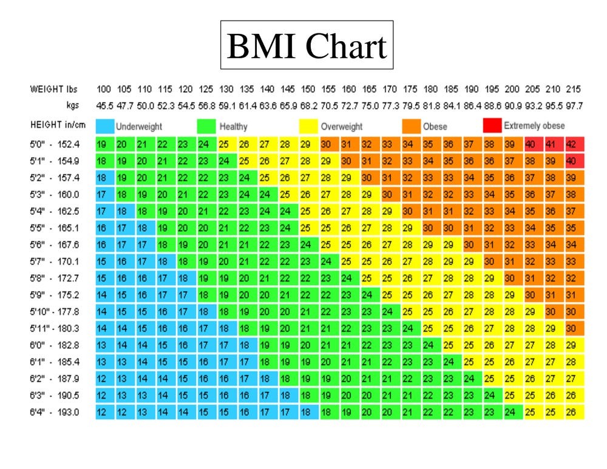

```{r setup, include=FALSE}
knitr::opts_chunk$set(echo = TRUE, cache=TRUE, warning = FALSE)
```

```{r, include = FALSE}
library(DALEX)
library(DALEXtra)
library(OpenML)
library(mlr)
library(pROC)
library(ggplot2)
library(reshape2)
library(knitr)
library(naniar)
library(visdat)
library(mice)
library(ggplot2)
library(gridExtra)
library(ranger)
library(kableExtra)
library(ghostscript)

set.seed(13)

diabetes <- read.csv("diabetes.csv")

diabetes$class[diabetes$class == "tested_positive"] <- 1
diabetes$class[diabetes$class == "tested_negative"] <- 0
```

## Data description
In the dataset there are 8 features and 1 target.

- `preg` : number of pregnancies
- `plas` : plasma glucose concentration (mg/dL) at 2 hours in an OGTT (oral glucose tolerance test) - a test in which subject is given glucose and blood samples are taken afterward to determine how quickly it is cleared from the blood
- `pres` : blood pressure (mm Hg)
- `skin` : triceps skinfold thickness (mm) measured at the back of the left arm. A measurement giving rough information about body fat percentage.
- `insu` : 2-hour serum insulin (mu U/ml)
- `mass` : BMI index (weight in kg/(height in meters)^2)
- `pedi` : diabetes pedigree function outcome, where DBF is a function that uses information from parents, grandparents, siblings, aunts and uncles, and first cousins and provides a measure of the expected genetic influence of affected and unaffected relatives on the subject’s eventual diabetes risk
- `age` : age (years)
- `class` (target): 1 if tested positive for diabetes, 0 otherwise


## Data distribution

```{r zmienne, fig.height=6, fig.width=9}
library(ggplot2)
library(gridExtra)
variables <- names(diabetes)

plots <- lapply(variables, function(variable){
  ggplot(data=diabetes, aes_string(variable)) +
    geom_bar(fill='darkred') +
    ylab('')
})

grid.arrange(grobs=plots, ncol=3)
```

The classes 'tested_negative' and 'tested positive' are unbalanced, the first one being around twice as big as the latter.

The variables `preg` and `age` have simmilar distributions, which makes sense, as an older women is more likely to have been pregant more times.

As we can see, the variables `plas`, `pres`, `skin`, `insu` and `mass` contain 0 values that are clearly outliers. We have the right to suspect that those are hidden outliers.  


## Visualisation of missing data

Let's assume that in all variables accept `preg`(where those are logically justified) value 0 is a missing data. Let's visualize how many missing values are there in the dataset.

```{r}
diabetes_NA<-diabetes
diabetes_NA[diabetes_NA == 0] <- NA
diabetes_NA$preg[is.na(diabetes_NA$preg)] <- 0
diabetes_NA$insu[is.na(diabetes_NA$insu)] <- 0
diabetes_NA$class[is.na(diabetes_NA$class)] <- 0
```

```{r, results='markup'}
visdat::vis_dat(diabetes_NA)
```

```{r, results='markup'}
knitr::kable(naniar::miss_var_summary(diabetes_NA), caption = "Procent of missing in dataset")
```


In the column `insu` there are almost 50% of missing values, and in `skin` - almost 30%. Simply omitting all rows with those values would significantly reduce the size of our dataset, so we can't afford to do that. In the future we will consider using imputation techiques to fill those values with meaningful data or dropping columns `insu` and/or `mass` if it improves the model performance.


## Correlation heatmap

```{r}
diabetes$class <- as.numeric(diabetes$class)
diabetes_cor <- round(cor(diabetes),2)
diabetes_cor <- melt(diabetes_cor)
ggplot(data = diabetes_cor, aes(x=Var1, y=Var2, fill=value)) + 
  scale_fill_gradient2(low = "blue", high = "red", mid = "white", 
  midpoint = 0, limit = c(-1,1), space = "Lab")+
  geom_tile()+
  geom_text(aes(Var2, Var1, label = value), color = "black", size = 4)
```


## Example model

### Ranger

```{r message=FALSE}
m <- sample(1:nrow(diabetes), 0.7*nrow(diabetes))
diabetes_train_original <- diabetes[m,]
diabetes_test_original <- diabetes[-m,]
diabetes_train$class <- as.factor(diabetes_train_original$class)
classif_task <- makeClassifTask(id = "lvr", data = diabetes_train_original, target = "class")
classif_lrn <- makeLearner("classif.ranger", predict.type = "prob")
model <- mlr::train(classif_lrn, classif_task)
pred_test <- predict(model, newdata = diabetes_test_original)$data$prob.0
roc <- roc(diabetes_test$class, pred_test)
roc$auc
plot(roc)
```

AUC: 0,8261

## Different datasets versions

```{r}
m <- sample(1:nrow(diabetes_NA), 0.7*nrow(diabetes_NA))
diabetes_train <- diabetes_NA[m,]
diabetes_test<- diabetes_NA[-m,]
```

### Omitting missing data

In this version we will simply omit all the missing data in the dataset.
```{r naomit}
#train
diabetes_train_naomit<-na.omit(diabetes_train)
#test
diabetes_test_naomit<-na.omit(diabetes_test)

# displaying dataset dimensions
dim(diabetes_train_naomit)
dim(diabetes_test_naomit)
```

### Imputation using mice
For this version we will use a simple mice imputation using PMM method.
```{r mice}
# train
imp_train1 <- mice(diabetes_train, method = "pmm", m = 1, maxit = 1, nnet.MaxNWts=3000)
diabetes_train_mice <- mice::complete(imp_train1)

#test
imp_test1 <- mice(diabetes_test, method = "pmm", m = 1, maxit = 1, nnet.MaxNWts=3000)
diabetes_test_mice <- mice::complete(imp_test1)

# displaying dataset dimensions
dim(diabetes_train_mice)
dim(diabetes_test_mice)
```

### Skipping skin, insu and pres columns

Experiments show, that variables `skin`, `insu` and `pres` often prove to be insignificant. The `skin` variables also has the sighest correlation values with other variables. We will delete them from the dataset, and then impute the few missing values in `mass` and `plas` variables uing mice.

```{r skip}
# train
diabetes_train_skip<-diabetes_train[,-c(3,4,5)]
imp_train2 <- mice(diabetes_train_skip, method = "pmm", m = 1, maxit = 1, nnet.MaxNWts=3000)
diabetes_train_skip <- mice::complete(imp_train2)

#test
diabetes_test_skip<-diabetes_test[,-c(3,4,5)]
imp_test2 <- mice(diabetes_test_skip, method = "pmm", m = 1, maxit = 1, nnet.MaxNWts=3000)
diabetes_test_skip <- mice::complete(imp_test2)

# displaying dataset dimensions
dim(diabetes_train_skip)
dim(diabetes_test_skip)

```

## Checking performance of Ranger on datasets

To evaluate the performance we will use AUC, BalancedAccuracy and FalseNegativeRate - which will tell us how many patients the model assigns as healthy despite having diabetes.

```{r}
train_datasets<-list()
train_datasets[[1]]<-diabetes_train_naomit
train_datasets[[2]]<-diabetes_train_mice
train_datasets[[3]]<-diabetes_train_skip
train_datasets[[4]]<-diabetes_train_original
test_datasets<-list()
test_datasets[[1]]<-diabetes_test_naomit
test_datasets[[2]]<-diabetes_test_mice
test_datasets[[3]]<-diabetes_test_skip
test_datasets[[4]]<-diabetes_test_original
auc<-c(0,0,0,0)
FNR<-c(0,0,0,0)
BAC<-c(0,0,0,0)

for(i in 1:4){
  
  classif_task <- makeClassifTask(data = train_datasets[[i]], 
                                  target = "class")
  classif_lrn <- makeLearner("classif.ranger", 
                           predict.type = "prob")
  model <- mlr::train(classif_lrn, classif_task)
  prediction<- predict(model, 
                       newdata = test_datasets[[i]])$data
  
  # auc
  auc[i] <- round(measureAUC(probabilities = prediction$prob.1,
                       truth = prediction$truth,
                       negative="0",
                       positive = "1"),4)
  
  FNR[i] <- round(measureFPR(prediction$truth, 
                       prediction$response,
                       negative="0",
                       positive = "1"),4)
  BAC[i]<-round(measureBAC(prediction$truth, 
                       prediction$response),4)
  
}

```

## Ranger Results

```{r results}
results<-data.frame(AUC=auc, BAC=BAC, FNR=FNR)
row.names(results)<-c("naomit", "mice", "skip", "original")
results %>%
  kbl() %>%
  kable_styling()
```


## Data Skip

```{r message=FALSE, echo=FALSE}

AUC<-c(0,0,0,0,0)
FNR<-c(0,0,0,0,0)
BAC<-c(0,0,0,0,0)

classifiers=c("classif.ranger", "classif.ada", "classif.binomial", "classif.gbm", "classif.naiveBayes", "classif.randomForest")

classif_task <- makeClassifTask(id = "lvr", data = diabetes_train_skip, target = "class")

for (i in 1:length(classifiers)){
    classif_lrn <- makeLearner(classifiers[i], predict.type = "prob")
    model <- mlr::train(classif_lrn, classif_task)
    pred_test <- predict(model, newdata = diabetes_test_skip)$data
    AUC[i] <- round(measureAUC(probabilities = pred_test$prob.1,
                       truth = pred_test$truth,
                       negative="0",
                       positive = "1"),4)

    FNR[i] <- round(measureFPR(pred_test$truth,
                       pred_test$response,
                       negative="0",
                       positive = "1"),4)
    BAC[i] <- round(measureBAC(pred_test$truth,
                       pred_test$response),4)
    
}  

res<-data.frame(AUC=AUC, BalancedAccuracy=BAC, FalseNegativeRate=FNR)
row.names(res)<-c("Ranger", "Ada", "Binomial", "GBM","Naive Bayes","Random forest")
res
```


```{r}
res %>%
  kbl() %>%
  kable_styling()

```

## Data Original

```{r message=FALSE, echo=FALSE}

AUC<-c(0,0,0,0,0)
FNR<-c(0,0,0,0,0)
BAC<-c(0,0,0,0,0)

classifiers=c("classif.ranger", "classif.ada", "classif.binomial", "classif.gbm", "classif.naiveBayes", "classif.randomForest")

classif_task <- makeClassifTask(id = "lvr", data = diabetes_train_original, target = "class")

for (i in 1:length(classifiers)){
    classif_lrn <- makeLearner(classifiers[i], predict.type = "prob")
    model <- mlr::train(classif_lrn, classif_task)
    pred_test <- predict(model, newdata = diabetes_test_original)$data
    AUC[i] <- round(measureAUC(probabilities = pred_test$prob.1,
                       truth = pred_test$truth,
                       negative="0",
                       positive = "1"),4)

    FNR[i] <- round(measureFPR(pred_test$truth,
                       pred_test$response,
                       negative="0",
                       positive = "1"),4)
    BAC[i] <- round(measureBAC(pred_test$truth,
                       pred_test$response),4)
    
}  

res<-data.frame(AUC=AUC, BalancedAccuracy=BAC, FalseNegativeRate=FNR)
row.names(res)<-c("Ranger", "Ada", "Binomial", "GBM","Naive Bayes","Random forest")
res
#png("img\results_original.png")
#p<-tableGrob(res)
#grid.arrange(p)
#dev.off()

```
```{r}
res %>%
  kbl() %>%
  kable_styling()

```

## Explanations

```{r boxlot mass}
boxplot(diabetes$mass, horizontal = TRUE)
mean(diabetes$mass)

library(ggplot2)
diabetes_skip<-rbind(diabetes_train_skip, diabetes_test_skip)
ggplot(diabetes_skip, aes(x=mass)) +
  geom_boxplot(fill="#99d8c9")+
  xlim(-0.2,0.2)
  theme_minimal()
```



### Model ranger

```{r}
# model_random_skip_ranger <- ranger::ranger(class~., data = diabetes_train_skip, classification = TRUE, probability = TRUE, num.trees=776, mtry=1, min.node.size=8, splitrule="extratrees")
 
samp <- c(140,190,202,214,74)

classif_task <- makeClassifTask(id = "ranger_tune_random", data = diabetes_train_skip, target = "class")
classif_lrn <- makeLearner("classif.ranger", predict.type = "prob", par.vals = list(num.trees=776, mtry=1, min.node.size=8, splitrule="extratrees"))
model_random_skip_ranger<- mlr::train(classif_lrn, classif_task)
explainer <- explain(id= 'Ranger', label="Ranger", model = model_random_skip_ranger,
                     data = diabetes_test_skip[,-6],
             y = as.numeric(as.character(diabetes_test_skip$class)))

```

### Model ada

```{r}
classif_task <- makeClassifTask(id = "ada_tune_random", data = diabetes_train_skip, target = "class")
classif_lrn <- makeLearner("classif.ada", predict.type = "prob", par.vals = list(loss='logistic', type='discrete', iter=81, max.iter=3, minsplit=45, minbucket=4, maxdepth=1))
model_random_skip_ada<- mlr::train(classif_lrn, classif_task)
explainer_ada <- explain(id='Ada',label="Ada", model = model_random_skip_ada,
                     data = diabetes_test_skip[,-6],
             y = as.numeric(as.character(diabetes_test_skip$class)))

```


```{r message=FALSE, echo=FALSE}

AUC<-c(0,0)
FNR<-c(0,0)
BAC<-c(0,0)

models<-list()
models[[1]]<-model_random_skip_ranger
models[[2]]<-model_random_skip_ada

for (i in 1:length(models)){
    model<-models[[i]]
    pred_test <- predict(model, newdata = diabetes_test_skip)$data
    AUC[i] <- measureAUC(probabilities = pred_test$prob.1,
                       truth = pred_test$truth,
                       negative="0",
                       positive = "1")

    FNR[i] <- measureFPR(pred_test$truth,
                       pred_test$response,
                       negative="0",
                       positive = "1")
    BAC[i] <- measureBAC(pred_test$truth,
                       pred_test$response)
    
}  

res<-data.frame(AUC=AUC, BalancedAccuracy=BAC, FalseNegativeRate=FNR)
row.names(res)<-c("Tuned Ranger", "Tuned Ada")
res
#png("img\results_tuned.png")
#p<-tableGrob(res)
#grid.arrange(p)
#dev.off()
```

```{r}
cp_profile_1 <- predict_profile(explainer, diabetes_test_skip[samp,-6])
ceteris_paribus<-plot(cp_profile_1, color = "_ids_")
png("images/2-4-ceteris-paribus.png")
grid.arrange(ceteris_paribus)
dev.off()

```


```{r}
model_type.dalex_explainer <- DALEXtra::model_type.dalex_explainer
predict_model.dalex_explainer <- DALEXtra::predict_model.dalex_explainer

lime_ranger1 <- predict_surrogate(
  explainer = explainer,
  new_observation = diabetes_test_skip[samp[1], -6], 
  n_features = 3, 
  n_permutations = 1000,
  type = "lime")

plot(lime_ranger1)

```

```{r}
pp_bd_1 <- predict_parts(explainer, new_observation = diabetes_test_skip[samp[1], -6], type = "break_down")
plot(pp_bd_1)
```


```{r}
pp_shap_1 <- predict_parts(explainer, new_observation = diabetes_test_skip[samp[2], -6], type = "shap", B = 5)
plot(pp_shap_1)
```

```{r}
pp_bd_1 <- predict_parts(explainer, new_observation = diabetes_test_skip[samp[2], -6], type = "break_down")
plot(pp_bd_1)
```

```{r}
pp_shap_1 <- predict_parts(explainer, new_observation = diabetes_test_skip[samp[2], -6], type = "shap", B = 5)
plot(pp_shap_1)
```

```{r}
pp_bd_1 <- predict_parts(explainer, new_observation = diabetes_test_skip[samp[3], -6], type = "break_down")
plot(pp_bd_1)
```

```{r}
pp_shap_1 <- predict_parts(explainer, new_observation = diabetes_test_skip[samp[3], -6], type = "shap", B = 5)
plot(pp_shap_1)
```

```{r}
pp_bd_1 <- predict_parts(explainer, new_observation = diabetes_test_skip[samp[4], -6], type = "break_down")
plot(pp_bd_1)
```

```{r}
pp_shap_1 <- predict_parts(explainer, new_observation = diabetes_test_skip[samp[4], -6], type = "shap", B = 5)
plot(pp_shap_1)
```
```{r}
pp_bd_1 <- predict_parts(explainer, new_observation = diabetes_test_skip[samp[5], -6], type = "break_down")
plot(pp_bd_1)
```

```{r}
pp_shap_1 <- predict_parts(explainer, new_observation = diabetes_test_skip[samp[5], -6], type = "shap", B = 5)
plot(pp_shap_1)
```

## Global Explanations

### Variable importance

```{r}
fi_1 <- model_parts(explainer, B = 10)
fi_2 <- model_parts(explainer_ada, B = 10)
#fi_1$label<-"ranger"
#fi_2$label<-"ada"
plot(fi_1, fi_2)
```

```{r}
variable_importance<-plot(fi_1, fi_2)
png("images/variable_importance.png")
grid.arrange(variable_importance)
dev.off()

```
### Average influence on prediction

```{r, fig.height=6, fig.width=9}
pdp_1 <- model_profile(explainer)
pdp_2 <- model_profile(explainer_ada)

plot(pdp_1, pdp_2)
```
```{r}
pdp<-plot(pdp_1, pdp_2)
png("images/2-4-pdp.png")
grid.arrange(pdp)
dev.off()

```

```{r, fig.height=6, fig.width=9}
pdp_3 <- model_profile(explainer,k=2)
pdp_4 <- model_profile(explainer_ada,k=2)
plot(pdp_3, geom = "profiles")
```
```{r, fig.height=6, fig.width=9}
plot(pdp_4, geom = "profiles")
```


### ALE

```{r, fig.height=6, fig.width=9}
ale_1 <- model_profile(explainer,type="accumulated")
ale_2 <- model_profile(explainer_ada,type="accumulated")

plot(ale_1, ale_2)
```


```{r, fig.height=6, fig.width=9}
ale_3 <- model_profile(explainer,k=2,type="accumulated")
ale_4 <- model_profile(explainer_ada,k=2,type="accumulated")

plot(ale_3, geom = "profiles")
```

```{r, fig.height=6, fig.width=9}
plot(ale_4,geom = "profiles")
```


```{r, fig.height=6, fig.width=9}
pdp_4 <- model_profile(explainer, variables = "plas")
ale_4 <- model_profile(explainer, variables = "plas",type="accumulated")
ale_4$agr_profiles$`_label_` <- "ale_ranger"
pdp_4$agr_profiles$`_label_` <- "pdp_ranger"
pdp_5 <- model_profile(explainer_ada, variables = "plas")
ale_5 <- model_profile(explainer_ada, variables = "plas",type="accumulated")
ale_5$agr_profiles$`_label_` <- "ale_ada"
pdp_5$agr_profiles$`_label_` <- "pdp_ada"
plot(pdp_4,ale_4,pdp_5,ale_5)
```

```{r, fig.height=6, fig.width=9}
pdp_4 <- model_profile(explainer, variables = "mass")
ale_4 <- model_profile(explainer, variables = "mass",type="accumulated")
ale_4$agr_profiles$`_label_` <- "ale_ranger"
pdp_4$agr_profiles$`_label_` <- "pdp_ranger"
pdp_5 <- model_profile(explainer_ada, variables = "mass")
ale_5 <- model_profile(explainer_ada, variables = "mass",type="accumulated")
ale_5$agr_profiles$`_label_` <- "ale_ada"
pdp_5$agr_profiles$`_label_` <- "pdp_ada"
plot(pdp_4,ale_4,pdp_5,ale_5)
```