```{r setup, include=FALSE}
knitr::opts_chunk$set(echo = TRUE)
```

## Abstract

## Keywords

# Introduction (Jung)

What do we lready know about diabetes

Research question?

# Methods

## Dataset (Jung)

descriptions, distributions, missing data

## Dataset versions (Jung)

original, naomit, mice, skip

## Measures

AUC, BAlanced Accuracy and False Negative Rate

## Models (Martyna)

To identify the models, that could potentially be efficient classificators on this dataset, we measured the AUC, BAlanced Accuracy and False Negative Rate measures on 6 different classification models from `mlr` package:


### Ranger - 
Random regression forest

### Adaboost 
Adaptive Boosting

### Binomial
Binomial Regression

### GBM
Gradient Boosting Machine

### Naive Bayes
Naive Bayes

### Random Forest
Random Forest


## Explanations (Karol)

In this section we will take time to investigate some model explanations that we will be using later. Feel free to use this chapter as reference for quick overview. For more in-depth knowledge please refer to https://ema.drwhy.ai/InstanceLevelExploration.html //bookdown?? TODO

### Local

Local explanations allow us to better understand model's prediction from the level of single observations. This can be useful when we want to evaluate predictions for particular instances. For example, which values have the most importance for the particular observations, or how the change in variables would impact the result. Local explanations combined with professional expertise could sometimes hint towards potential problems with the model in case they contradict each other. 

#### Break Down

In this explanation all observations start from the same base that is the mean prediction for all data. Next steps consist of fixing consecutive variables on values from the observation in question and measuring the change in mean prediction that is now calculated with some of the values fixed. This shift in mean prediction is interpreted as the impact of this variable's value on prediction for this observation. Figure TODO shows the corresponding steps.


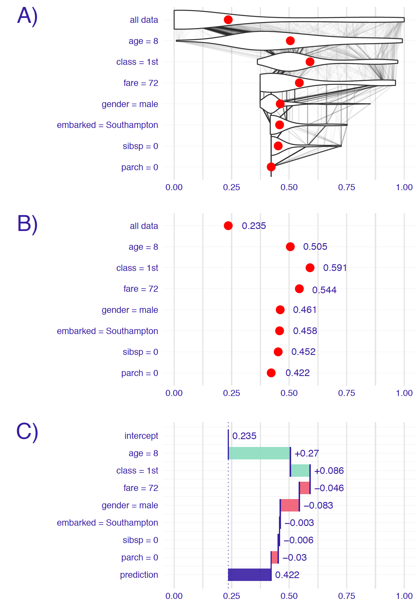
Figure: Panel A shows the distribution and mean prediction with values on the same level and above fixed on values from observation.
Then change in mean is calculated and assigned to corresponding variables.

A big drawback for this method is how the order of variable can influence the explanation outcome. This problem occurs most often as a result of existing interactions between variables as seen in OBRAZEK TODO

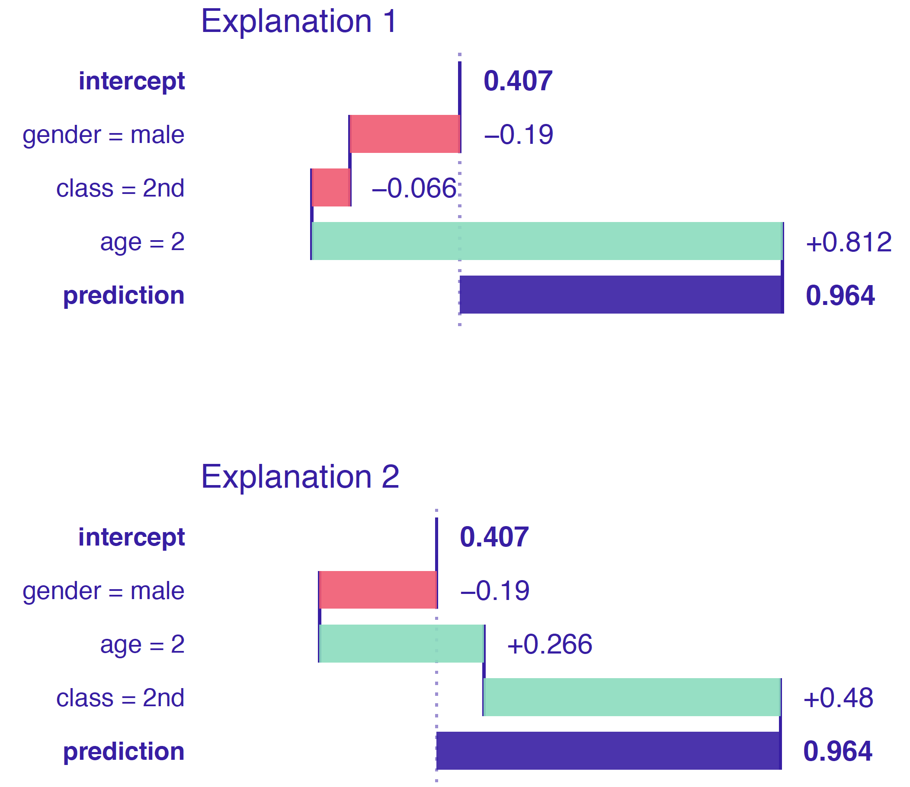
Figure: Variables age and class interact with each other so the changing order results in different plots

#### Shap

Shap is a direct response to the biggest problem of Break Down method that is the ordering chosen for explanation could alter the results as seen in figure TODO. Shap takes a number of permutation and calculates the average response of Break Down on these permutations. More permutations result in more stable explanations. Exemplary output is shown in figure TODO.

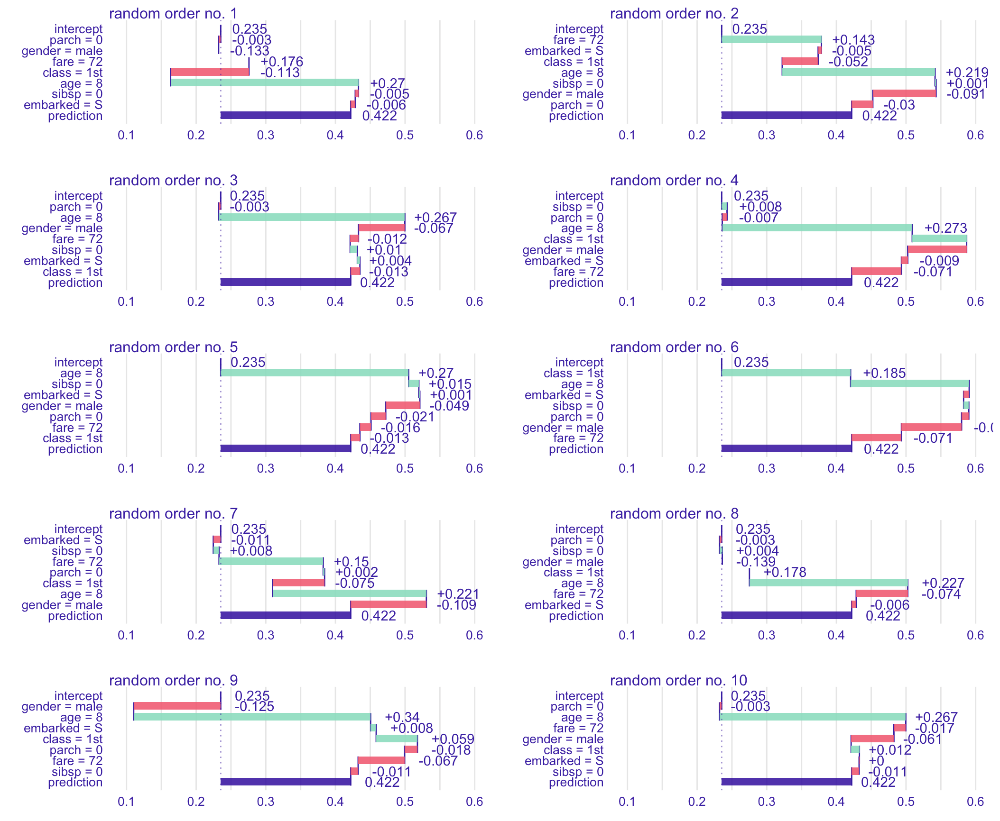
Figure: Different results of Break Down for 10 random variable orders

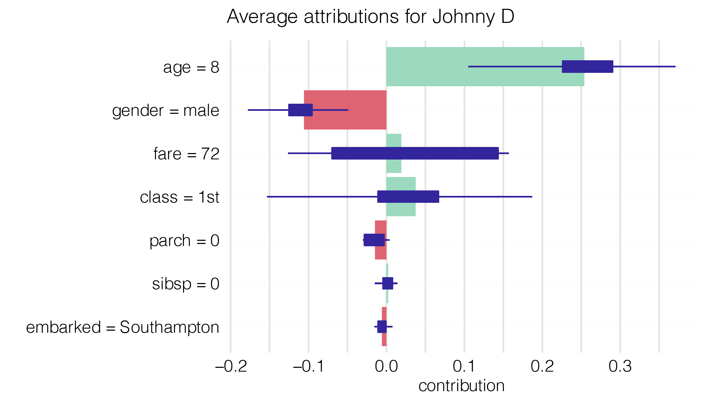
Figure: Shap output. Average impact calculated with Break Down for 10 permutations

#### Lime

The essence of Lime is to locally approximate the black box model with a glass box one. Then we can use it for local explanations that should yield results appropriate for the black box. Firstly, we generate data "close" to our observation (also called Point of Interest) and make predictions with black box model. Based on those predictions we try to fit the glass box model that accurately predicts those observations. In result we receive a glass box model that should behave the same as original model as long as we remain close to the Point of interest. Figure TODO describes the idea.


Figure: Colored areas correspond to different prediction for the black box model. Black cross is our Point of Interest and circles are generated data. The line represents our simpler model that approximates original model around Point of Interest

This method is often used for datasets consisting of many variables. Methods like Break down and Shap come out short in these situations.

#### Ceteris Paribus

Ceteris Paribus is a Latin phrase meaning "all else unchanged". This accurately describes what it does. For the certain observation we take values that are interesting to us and observe how the prediction changes as we change values in those columns one at a time. This can yield interesting conclusions about change in values and its impact on predictions. Figures TODO and TODO show prediction change as responce for variable change.

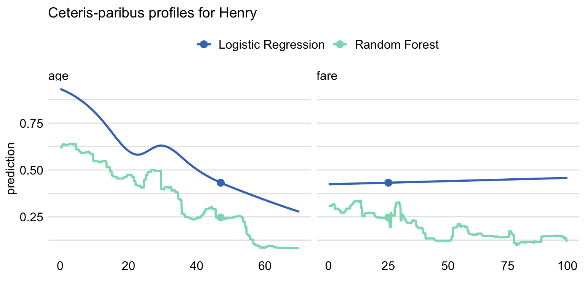
Figure: Shape of lines resebles the nature of the model. Dot shows value and model's prediction for the observation.

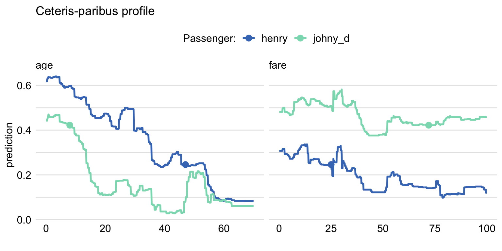
Figure: Ceteris Paribus shows different importance in variables and their changes for different observations

Ceteris Paribus is very popular due to its simplicity and interpretability. The biggest drawback however is the possibility of unpredictable or misleading results. For example, with fixed variable age set to 18, predicting outcome for a significant number of pregnancies does not make sense. It is also hard to capture interactions when working with variables separately.

### Global

As the name implies in global explanations we look at variables from the perspective of whole dataset. We can check the importance of variable for the model or analyze average impact of certain values on predictions.

#### Feature Importance

The main idea behind Feature Importance is measuring how important each variable is for model's predictions. To do that we measure the change in AUC after permutating values of each variable. The bigger the change, the bigger importance of variable. To stabilize the results, we can measure average change for a number of permutations. In figure TODO we can see that variable gender is the most important for model's prediction.

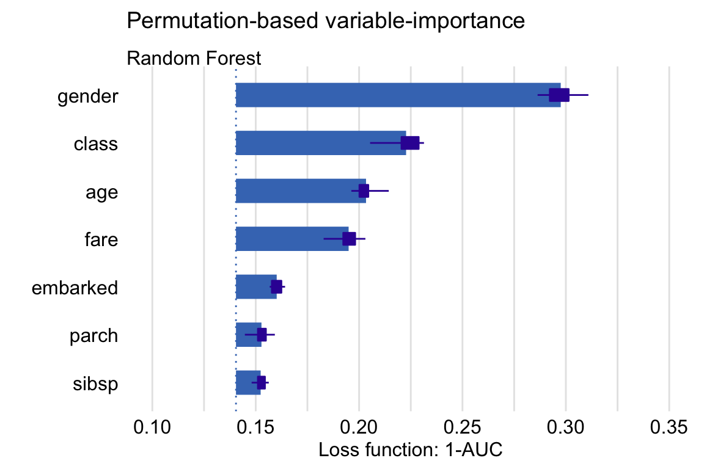
Figure: Feature Importance output for 10 permutations

#### Partial Dependence

To put it short, Partial Dependence is the average of Ceteris Paribus for whole data. This results in average importance and impact of variable and its values. The similarities can be observed in figure TODO


Figure: Multiple observations with Ceteris Paribus and their average as Partial Dependence

As we can see observations can return different shapes for Ceteris Paribus, hence averaging them could mean loss of information. To answer this problem Partial Dependence implements grouping and clustering that could show the difference as shown in figure TODO.

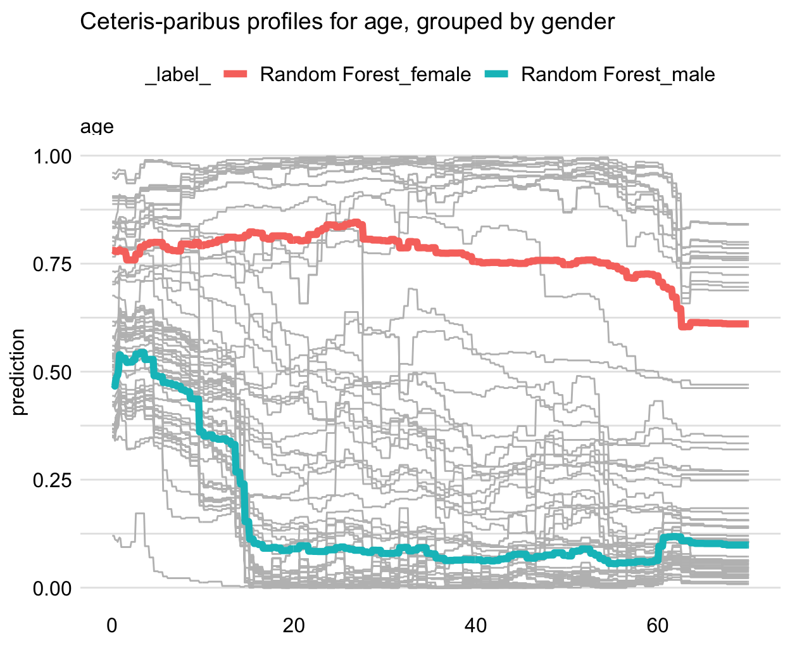
Figure: Partial Dependence grouped by sex

As in Ceteris Paribus this method is very simple and understandable. However, it also carries over the same problems resulting from correlated variables.

#### Accumulated Dependence

Also referred as Accumulated-Local Dependence. It is the direct answer for correlation issue in Partial Dependence. The construction of Accumulated Dependence is the same as in Ceteris Paribus. The only difference being how the observations are summarized. Partial Dependence uses marginal distribution while Accumulated Dependence uses conditional distribution. This means that when there are at most negligible correlations, Accumulated Dependence yields results very similar to Partial Dependence.


# Results

## Model comparison (Martyna)

The models were checked on both `original` and `skip` dataset version, with the following results:

### Data Original
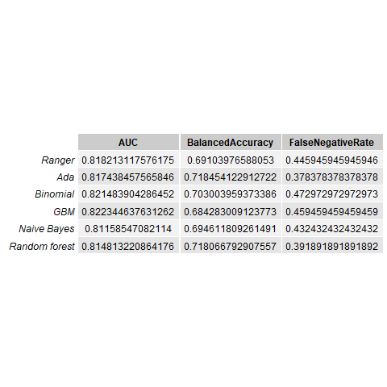

The measure values between models are very similar, however, 

### Data Skip
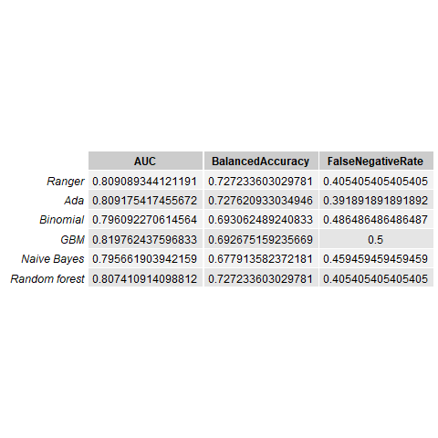

Based on the results, two models: Ranger and Ada where chosen for further analysis. Hyperparamether tuning using random grid search was peformed, resulting in classificators with the following values:


Ranger
 - num.trees=776, 
 - mtry=1,
 - min.node.size=8
 - splitrule="extratrees"
 
Ada
 - loss='logistic'
 - type='discrete',
 - iter=81,
 - max.iter=3,
 - minsplit=45, 
 - minbucket=4, 
 - maxdepth=1
 

## Explanations results

### Global

#### Variable Importance

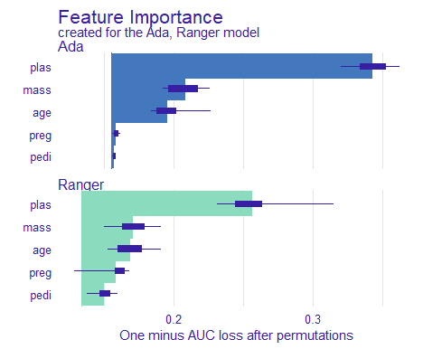
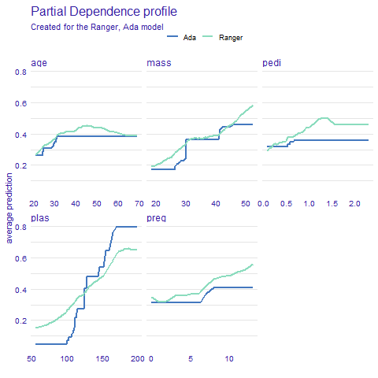

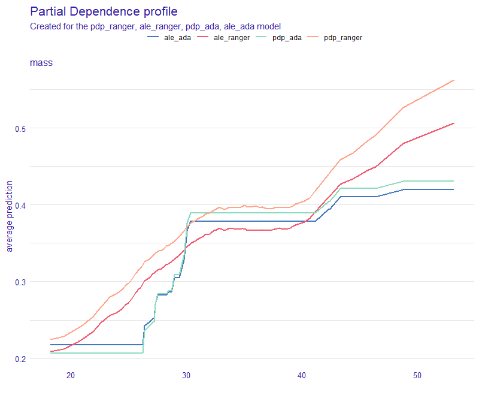

### Local

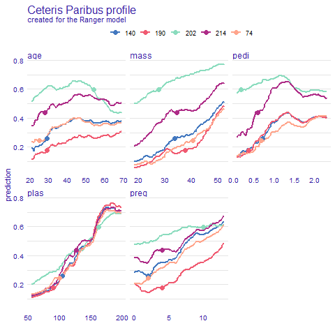

# Discussion

## Expert opions + comparison (Martyna)

# Conclusion

# References

